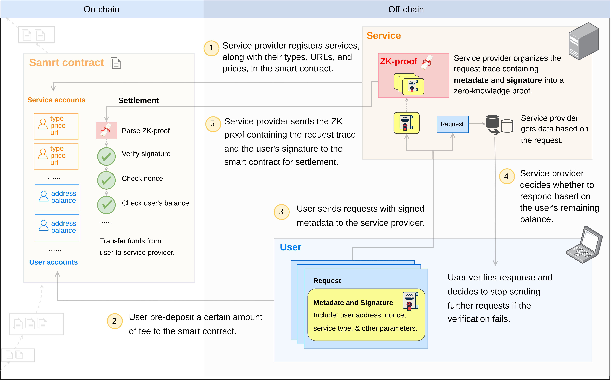

# 0G Serving Contract

## Objective

The contract facilitates interactions between `user` and `service provider` to achieve data retrieval and fee collection, meeting the following requirements:

1. The `service provider` registers the `service type` it provides and the price for each type in the smart contract.
2. When a `user` wants to access the service, they pre-deposit a certain amount of fee to the smart contract of the `service provider`.
3. The `user` can send requests to the `service provider`, who decides whether to respond based on whether the remaining fee is sufficient.
4. Each request and response are signed by the `user` and `service provider`, respectively.
5. The `service provider` can decide at any time to send the `request trace` with the `user` signature to the smart contract for settlement.
6. The `user` can verify each response, and if verification fails, decide to stop sending further requests.
7. The `service provider` needs to process more `user` requests in batches to settle once.
8. The `user` can request a refund, and after a certain time window, they can receive the refund (the time window is to ensure that there is a balance in the `user` account when the `service provider` settles). The owner of the contract can update the refund time window.
9. Introduce zk-proof mechanism to optimize on-chain settlement costs, organizing the `request trace` into smart contract input `proofs` for settlement.
10. Encourage each `user`'s requests to include keys for the data used for the service input so that the system can allocate incentives to data owners based on the popularity of their services when recorded on the chain.
11. To optimize accounting performance costs, request traces with data keys can be recorded in 0G storage.

## Glossary

1. `request trace`: a list of metadata from each request made by the `user` to the `service provider`, which the `service provider` can use to settle fees with the contract. Taking a contract combined with chatbot service as an example, each `metadata` should include `user address`, `nonce`, `service type`, number of tokens, creation time, and signature of the request. This information ensures the legality of the `request trace` and provides input information for the contract to calculate the applicable fees correctly.

## What to Do

1. Support the owner to modify the refund time window.
2. Support the `user` to pre-deposit fees to the contract.
3. Support the `user` to request a refund (`requestRefund`), which can be processed for a refund after the refund time window.
4. Support the `service provider` to register `service url/type/price` in the contract.
5. Support the `service provider` to modify the `url/price` of a specific `service type`.
6. Support the `service provider` to delete a specific `service type`.
7. Support the `service provider` to send multiple `request trace` with `user` signatures to the contract for settlement.
8. Support querying the balance of a `user` account.
9. Support querying `service url/type/price`.

## What Not to Do

1. Do not include the validation process for `user` to get data.

## Test Cases

Please refer to test/serving.spec.ts for test cases.

## Design

### Process Diagram

### Methods to Query Information on the Contract

The contract provides interfaces to query `user` and `service` information. Additionally, each state change on the contract triggers an event. Therefore, there are two ways to obtain relevant information, either through local querying or directly using the contract interface based on specific service types on a case-by-case basis.

1. Local Querying

    - The `user` client and `service provider` server listen to contract events and maintain their own databases.
    - Newly joined clients/servers can use the `getAllServices` and `getAllUsers` interfaces to get a snapshot of the current contract state for quick database setup.
    - Clients/servers can build more reasonable indexes locally to support more complex operations, such as using `service type`, `service price` as query parameters for filtered queries.

2. Direct Use of Contract Interface Queries

### Request Settlement

1. A single settlement can include multiple `request traces` from different `users`.
2. Each `request trace` contains a set of `requests` from the same `user`.
3. Each `request` includes metadata of a single request made by a `user` to the `service provider`: user address, nonce, service type, number of tokens, creation time, and signature.
4. The signature covers the other information in metadata, allowing the contract to verify the authenticity of all information in metadata through signature validation.
5. After verifying the legality of the signature, the contract needs to check the following conditions before transferring funds to the `service provider`. Failure to meet any of these conditions will result in settlement failure:
    1. Whether the nonce is valid.
    2. Whether the service has been modified since the request.
    3. Whether the user's account balance is sufficient for payment.

### Nonce

The nonce serves to identify each `request` to prevent duplicate settlements.

1. The Account structure in contract maintains a nonce field for each group of `user` and `service provider`.
2. The nonce in each `request` needs to be _greater than_ the stored nonce on the nonce field to be considered valid.
3. After each `request` settlement, update the corresponding nonce field.
4. Following the rules above, the `user` client ensures to send requests with increasing nonces, and the `service provider` server confirms upon receiving requests.
5. Other considered alternative solutions are discussed in [Nonce Maintenance](#nonce-maintenance)

### Refund

1. A `user` can apply for a refund by calling the `requestRefund` function. However, to ensure that the `service provider` can settle while there is still sufficient balance in the `user`'s account, the refund can only be processed after a certain lock time window.
2. Since the contract does not automatically return funds, applying for a refund even after the time window requires executing the `processRefund` function for the actual refund operation.

## Contract Code

### Serving.sol

1. Contains external interfaces supporting various operations listed in [What to Do](#what-to-do).
2. Stores variables of storage type: lockTime, userMap, serviceMap, representing "refund time window," user information, service information, and settlement request nonce information respectively. These variables hold the contract's state.

### User.sol

1. Library for userMap, containing operations related to `user`.

### Service.sol

1. Library for serviceMap, containing operations related to `service`.

### Request.sol

1. Contains functions for validating settlement requests.

## Considered Alternative Solutions

### Nonce Maintenance

1. Each user maintains an increasing `nonce`, and each `request` to the user must have a `nonce` greater than the one stored in the contract for that user.

    Issue: Sequential settlement order for a user with multiple `service providers` cannot be guaranteed. For instance, if a user makes three requests to `service provider A` with `nonces`: 1, 2, 3; and then three requests to `service provider B` with `nonces`: 4, 5, 6. If `service provider B` settles first and updates the contract nonce to 6, `service provider A` won't be able to settle.

2. Each `service provider` maintains an increasing `nonce`, and each `request` to the `service provider` must have a `nonce` greater than the maintained `nonce` to settle. As `nonce` is included in the user's signature and a `service provider` corresponds to multiple `users`, to prevent duplicates from different `users`, the `service provider` should have a set of requests for exchanging metadata information to inform each user what `nonce` to include in their subsequent requests.

    Pros:

    1. Compared to solution 3, it saves storage on the contract.

    Cons:

    1. Requires coordination between `service provider` server and different `users` to ensure all nonces are increasing.
    2. Requests from different `users` are interdependent. For example, requests with a smaller `nonce` from `user 1` temporarily failing to settle (e.g., due to insufficient balance) could prevent requests with a larger `nonce` from `user 2` from settling as well. Forcing a settlement would invalidate the requests with a smaller `nonce`.
